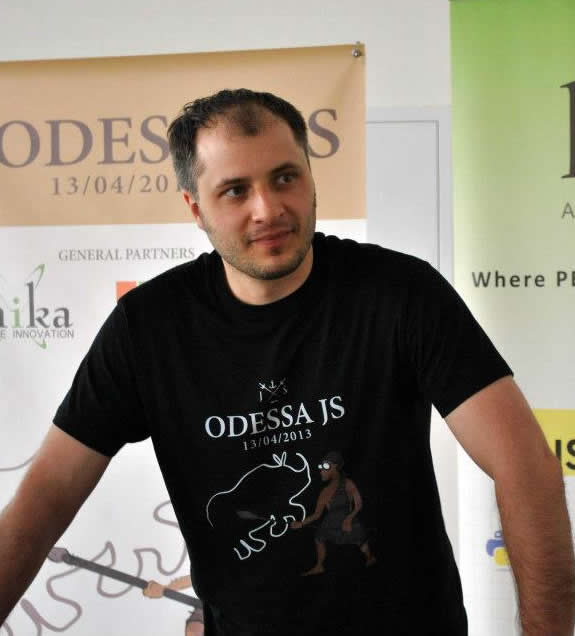

title: about
date: 2013-10-15 03:38:07
---
##Eldar Djafarov

**nodejs-dev / UA JS community guy**

*Ukrainian JS community leader and nodejs evangelist.*
```
mail: djkojb@gmail.com
skype: ka_djko
github: edjafarov
twitter: @edjafarov
```

In case you are thinking of hiring me you should know several things about what I can and what values I am standing on.

I am an **agile product developer** - I care about product more than about code which it would implement. My goal is to use your business knowledge to create great product for your customers.

I think managers are [useless](http://eldar.djafarov.com/2014/04/managers-are-taking-your-projects-breath/). Most of stuff managers usually do is just useless. Other roles could be taken by a team. Though I think to be effective - **everyone** of a team should commit into product.

**Please before hiring me ensure that you need exactly my experitise and not just closing abstract senior JavaScript developer position**. That would not probably work and I am sure that we can spend our working hours much better. Give this page to some technical guy to evaluate me if required **before** contacting me.

I am fullstack developer and I can build reasonable architecture top-to-bottom.

I love JavaScript and I think that you can solve 80% of webapps in JavaScript effectively. Though, I would never start building other 20% in JavaScript just because I love it.

My stack-of-choise is:
* **CommonJs** for code management
* [**component.js**](https://github.com/component/component) for dependency mamagement
* [**React.js**](http://facebook.github.io/react/) for UI modules
* [**semantic styling**](http://eldar.djafarov.com/2014/07/semantic-styling/)
* [**node.js**](http://nodejs.org/) for backend
* [**MongoDB**](http://www.mongodb.org/), [**Redis**](http://redis.io/) as a DB

I would prefer not to build anything with **angular.js** because I think that it has essential [flaws](https://github.com/edjafarov/edjafarov.github.io/tree/develop/source/_drafts).

I do not have CV - you can use my [linkedin](ua.linkedin.com/in/edjafarov/) profile.

To know more about my tecnical skills you can check my professional [blog](ua.linkedin.com/in/edjafarov/), my [slideshare](http://www.slideshare.net/eldardjafarov) and [github](https://github.com/edjafarov)

